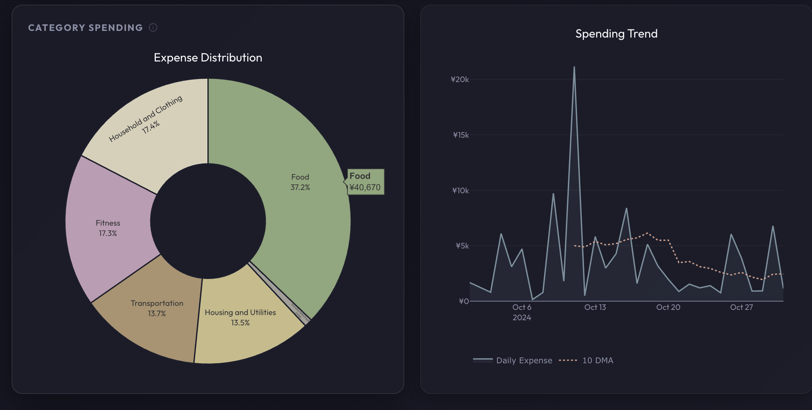
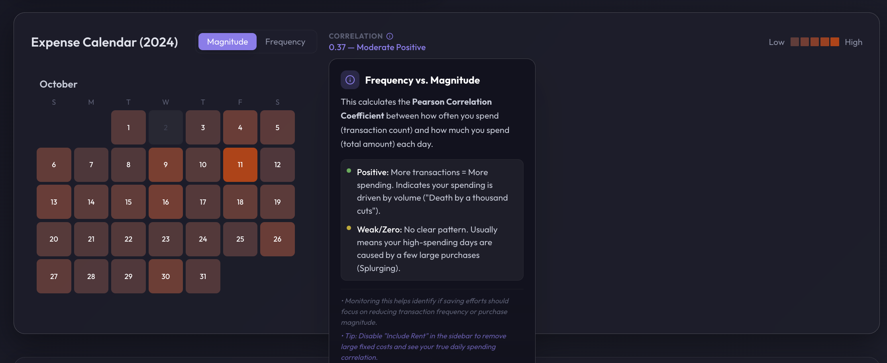
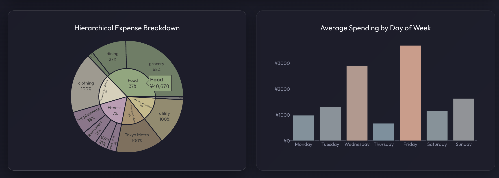
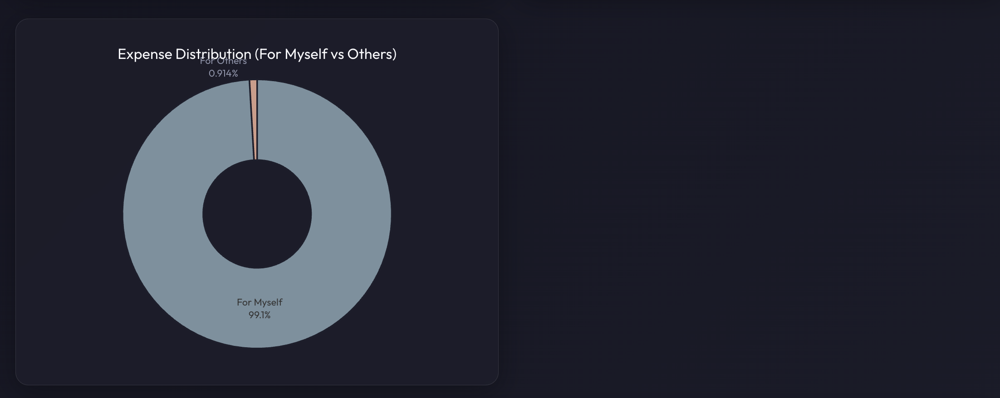
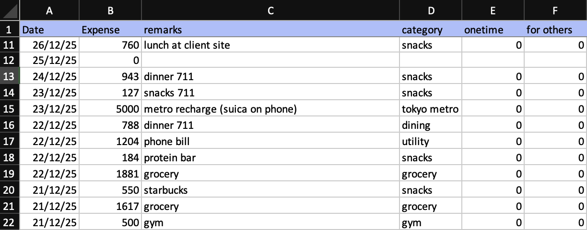

# Personal Expense Analysis

**A local-first web application for visualizing and analyzing personal financial data. Built with React, Vite, TailwindCSS, and local LLM integration (still a WIP).**

> **Dedication:**
> S/O to my dad, who told me to track my expenses, 10/10 advice that eventually resulted in this app.

## Background

Back in the summer of 2022, I had the good fortune of visiting McGill University to spend three months conducting research, for which I received adequate funding. My dad had advised me to log my expenses to monitor my spending, as it was my first time living independently. Like most 21-year-olds, I was a bit lazy at the time; I relied on simply checking my bank balance, counting the days left, and adjusting my spending accordingly. As a result, I saved less than I would've had I tracked my expenses properly.

When I moved to Tokyo for my first job in October 2023, I was determined to be more disciplined with my personal finances. I've been tracking my expenses diligently since day one, literally every expense I've incurred (to the best of my knowledge).

I manually log all expenses every week or two in an Excel sheet, which I have maintained since **2023/10/05** (retrieving the expenses from credit card statements and PayPay history; I rarely use cash, but I log that manually too). The logic behind this is that manual entry forces me to look at the Excel sheet and its huge list of past expenses, making me more cognizant of my spending. If I were just typing an expense into an app, I wouldn't see the previous expenses, thereby not feeling the cumulative impact of my spending habits.

I decided to build this web app to perform analysis and visualizations on this data. I also wanted to experiment with a new tech stack and build something tailored specifically for my personal use case.

I use this analysis to determine where or when I should cut down on expenses, and also to check if I can spend a little extra on discretionary items (sports merch, travel, etc.).

*Note: It's still a big WIP, but I'm uploading it to GitHub as my close friends requested it.*

## Showcase

<div align="center">
  <p><b>1. Dashboard Overview & Core Metrics</b></p>
  
  <p><i>The mission control of your finances. Instantly see your total burn, daily averages, and behavioral insights like "Category Streaks" and "Biggest Splurge".</i></p>
  <br/><br/>
  <div style="display: flex; gap: 10px; justify-content: center;">
    <div width="48%">
      
      <p><b>2. Spending Distribution</b><br/>Identify the chief pulls on liquidity at a glance.</p>
    </div>
    <div width="48%">
      
      <p><b>3. Expense Heatmap</b><br/>Toggle between <i>Magnitude</i> and <i>Frequency</i> to differentiate between days with high magnitude of expenses and days with high number of transactions.</p>
    </div>
  </div>
  <br/><br/>
  <div style="display: flex; gap: 10px; justify-content: center;">
    <div width="48%">
      
      <p><b>4. Hierarchical Sunburst</b><br/>Drill down from broad categories (Food) to specific sub-tags (Grocery vs Dining) in one visual.</p>
    </div>
    <div width="48%">
      
      <p><b>5. Personal vs. Shared</b><br/>To see how much I been spending on others vs. myself.</p>
    </div>
  </div>
</div>


## Roadmap & Ideas
1.  **Local AI Assistant (WIP)**: Refining the chat integration with Ollama to improve tool-calling reliability and analysis accuracy. A use case for this is to get the LLM to recommend a custom financial plan based on spending habits or get it to answer questions like "What are my top 3 expenses?" or "What are my top 3 categories?" or "Which day in XX month did I spend the most?" etc...
2.  **Predictive Analysis**: The cumulative expenses curve is usually linear and quite predictable. Using time series analysis, it should be possible to predict future expenses.
3.  **Budgeting Alerts**: Setting threshold alerts when spending in a specific category exceeds a monthly average.
4.  **Smart Category Mapping (WIP)**: An LLM-powered feature to analyze unique categories in uploaded files and suggest a draft mapping configuration, which users can then customize.

## Features
- **Advanced Expense Heatmap**: 
    - Toggle between **Magnitude** (amount spent) and **Frequency** (number of transactions).
    - **Year Navigator**: Browse multi-year datasets with a clean, focused UI.
    - **Behavioral Correlation**: Analyzes the relationship between transaction volume and cost.
- **Interactive Dashboard**: Sunburst charts, trend lines with moving averages, and category breakdowns.
- **Insight Cards**: Automatic detection of "Biggest Splurge", "Category Streaks" (with date drill-down), and "Priciest Categories".
- **Local Privacy**: Data is processed entirely in the browser; no file uploads to external servers.
- **Local AI Assistant (Beta/WIP)**: Chat integration with Ollama for data analysis (requires local Ollama server).
- **Multi-Currency Support**: Native support and locale-aware formatting for **JPY** and **INR**.

## Getting Started

### Prerequisites
- **Node.js**: v18 or higher recommended.
- **Ollama** (Optional): Required if you want to use the AI chat features. [Download Ollama](https://ollama.com/)

### Installation

1.  Clone the repository (or navigate to the project directory):
    ```bash
    cd javascript_app
    ```

2.  Install dependencies:
    ```bash
    npm install
    ```

### Running Locally (Mac, Linux, Windows)

Start the development server:
```bash
npm run dev
```
Open your browser to `http://localhost:5173` (or the port shown in the terminal).

### Building for Production

To create a static build for deployment:
```bash
npm run build
```
The output will be in the `dist/` directory.

---

## Data Format Requirements

The application expects an **Excel file (.xlsx or .xls)**. 

### Data Structure Examples
- **Independent Entries**: Each row represents a single independent expense.
- **Multiple Expenses per Date**: You can have multiple rows for the same date (e.g., three different items bought at different times).
- **Zero-Expense Days**: If you have a day with no spending, it is recommended to log it with `0` to keep the timeline continuous.

#### Visual Example:


| Column | Description | Example |
| :--- | :--- | :--- |
| **Date** | Date of the transaction | `2024-01-01` |
| **Expense** | Amount spent (positive number) | `550` |
| **remarks** | My comments or notes about the spend | `Dinner at Pizzakaya with friend A and friend B` |
| **category** | Raw category label I assign to the expense | `dining` |
| **onetime** | (Optional) `1` if it's a one-time purchase or a rare purchase | `0` |
| **for others**| (Optional) `1` if I buy something for my parents or treat some juniors, etc. (expenses where I'm not the direct beneficiary) | `0` |

> [!TIP]
> Use the **"Try with Demo Data"** button on the home screen to see the app in action and understand the required data structure.

---

## Configuration & Customization

The app is designed to be easily adapted to your personal logging style.

> [!IMPORTANT]
> **Custom Mapping Required:** The current configuration in `src/utils/categoryMapping.js` is tailored to my specific Excel labels. You **must** create your own mapping file to match your raw excel categories as shown below.
> 
> *Future Work:* I am working on a feature to allow the local LLM to analyze any uploaded excel and generate these category mappings dynamically!

**File:** [`src/utils/categoryMapping.js`](./src/utils/categoryMapping.js)

1.  **Map your keywords**: Add your Excel category strings to the `CATEGORY_MAPPING` object.
    ```javascript
    export const CATEGORY_MAPPING = {
        'my_raw_tag': 'Food', 
        'uber_eats': 'Food',
        // ...
    };
    ```
2.  **Define Colors**: Update `CATEGORY_COLORS` to change the theme of your dashboard.
    ```javascript
    export const CATEGORY_COLORS = {
        'Food': '#99b98b',
        'Leisure': '#d6a7c3',
        // ...
    };
    ```

---

## Setting up Local LLM (via Ollama)

To enable the "**Ask AI Assistant**" feature for natural language analysis:

1.  **Install Ollama**:
    Download it at [ollama.com](https://ollama.com).

2.  **Pull a Model**:
    The app works best with models between 3B and 8B parameters.
    ```bash
    ollama pull qwen2.5:3b
    # OR
    ollama pull llama3
    ```

3.  **Start Ollama Server**:
    By default, Ollama only allows local connections. To allow the web app to talk to it, use:
    ```bash
    OLLAMA_ORIGINS="*" ollama serve
    ```

4.  **Analyze**:
    Open the app, click "Ask AI Assistant" in the sidebar, choose your model, and ask away.
